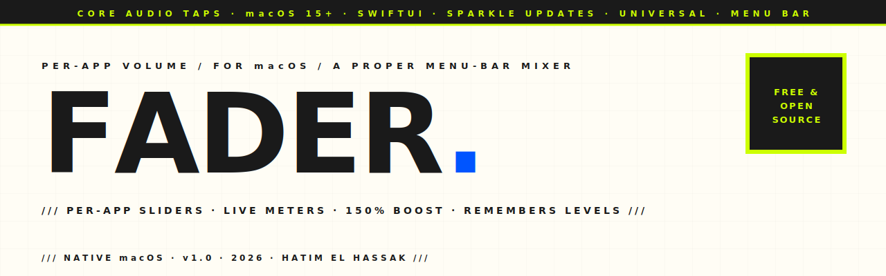

<picture>
  <source media="(prefers-color-scheme: dark)" srcset="assets-readme/hero-banner-dark.svg" />
  
</picture>

<p align="center">
  
  
  
  
  
</p>

<p align="center">
  <em>macOS never shipped a per-app volume mixer. <strong>Fader</strong> is the one it should have — a tiny menu-bar app that shows only the apps actually making sound and gives each one a slider, a mute, and a live meter. Turn the game down, push a quiet podcast past 100%, silence a tab — without touching any app.</em>
</p>

---

### `/// WHAT IT IS`

```
┌─────────────────────────────────────────────┐
│  ♪ Fader                              3   ⚙︎  │
├─────────────────────────────────────────────┤
│  🔈 OUTPUT      ───────●───────────           │
├─────────────────────────────────────────────┤
│   Spotify        ──────────●────────   95% 🔊 │
│                  ▔▔▔▔▔▔▔▔▔▔▔                  │
│   Google Chrome  ────●──────────────   40% 🔊 │
│                  ▔▔▔▔                         │
│   Discord        ●──────────────────    0% 🔇 │
└─────────────────────────────────────────────┘
```

A menu-bar popover that lists every app **currently playing audio** — nothing else — each with its own volume (0–150%), mute, and a moving level meter.

---

### `/// WHY IT EXISTS`

Windows has had a per-app volume mixer for fifteen years. macOS still doesn't — there's no public API to set another app's volume, so you're stuck riding one master slider while a game blasts and a video call whispers. The paid tools that fill the gap install audio drivers and bury the feature under EQs and routing matrices.

Fader does one thing, beautifully. It uses Apple's modern **Core Audio process taps** (macOS 14.4+) — no kernel extension, no driver install — to capture each app's audio, mute its original output, and re-render it at the level you choose. Open it, drag a slider, done.

---

### `/// HIGHLIGHTS`

| | |
|---|---|
| **Only what's playing** | The list shows apps that are actually using the speakers right now — not a wall of every open app. They appear and vanish as sound starts and stops. |
| **A slider per app** | 0–150% per app, with a soft-limited boost that makes quiet apps genuinely louder without harsh clipping. Plus one-tap mute and a live meter. |
| **Browser-aware** | YouTube in Chrome, a call in Discord, music in an Electron app — helper-process audio is grouped under one slider for the parent app. |
| **Remembers you** | Set Spotify to 40% once and it stays 40% every time it plays. Levels persist by app, across launches. |
| **Device-aware** | Switch to headphones or AirPlay and Fader follows the new output device automatically. |
| **No driver, no account** | Pure user-space Core Audio. Launch at login, one-click updates from GitHub, and it never records or sends your audio anywhere. |

---

### `/// INSTALL`

1. Download **`Fader.dmg`** from the [latest release](https://github.com/hatimhtm/Fader/releases/latest).
2. Drag **Fader** into **Applications**.
3. First launch: macOS will say it's from an unidentified developer (the app is open-source and ad-hoc signed, not paid-notarized). Right-click **Fader → Open**, or go to **System Settings → Privacy & Security → Open Anyway**.
4. Click the **speaker icon** in your menu bar, and **Allow** the one-time Audio Recording prompt — this is what lets Fader adjust each app's volume. It is never used to record.

Updates arrive in-app: **gear → Check for Updates** pulls the latest signed build straight from GitHub.

---

### `/// HOW IT WORKS`

```
each playing app ──▶ Core Audio process tap (muted) ──┐
                                                       ├─▶ private aggregate device
                                                       │     · per-app gain + soft limit
default output ◀── re-rendered stereo mix ◀────────────┘     · summed to your speakers
```

- **Process taps** (`AudioHardwareCreateProcessTap`, macOS 14.4+) capture a specific app's output and mute its normal playback.
- All taps feed **one private aggregate device**; a single real-time callback multiplies each app's audio by its slider gain, sums to stereo, soft-limits, and renders to your current output device.
- When you quit, every tap is torn down and apps return to normal — and any leftover device from a crash is cleaned up on next launch.

---

### `/// STACK`

```
Swift · SwiftUI · AppKit (MenuBarExtra)
Core Audio  — process taps + aggregate device + real-time IO
Sparkle     — signed, GitHub-hosted in-app updates (no App Store)
XcodeGen    — project generation from project.yml
Universal   — arm64 + x86_64, macOS 15+
```

---

### `/// PROJECT LAYOUT`

```
Fader/
├── Fader/                  SwiftUI sources
│   ├── FaderApp.swift          menu-bar app + Settings window
│   ├── AudioEngine.swift       taps, aggregate device, real-time mix
│   ├── AudioApp.swift          "what's playing" scanner + helper grouping
│   ├── MixerView.swift         the popover UI
│   ├── SettingsView.swift      launch-at-login, updates
│   ├── Updater.swift           Sparkle wiring
│   └── …                       permission, prefs, master volume
├── scripts/
│   ├── build.sh                dev build + relaunch
│   ├── release.sh              universal build → DMG + zip + signed appcast
│   └── make-icon.swift         app-icon generator
├── project.yml             XcodeGen config
└── CHANGELOG.md
```

**Build it yourself:** `scripts/build.sh` (needs Xcode + `xcodegen`).

---

### `/// LICENSE`

MIT — © 2026 Hatim El Hassak. Use it, fork it, learn from it.

<p align="center">
  <a href="https://hatimelhassak.is-a.dev"></a>
  <a href="https://github.com/hatimhtm"></a>
</p>
